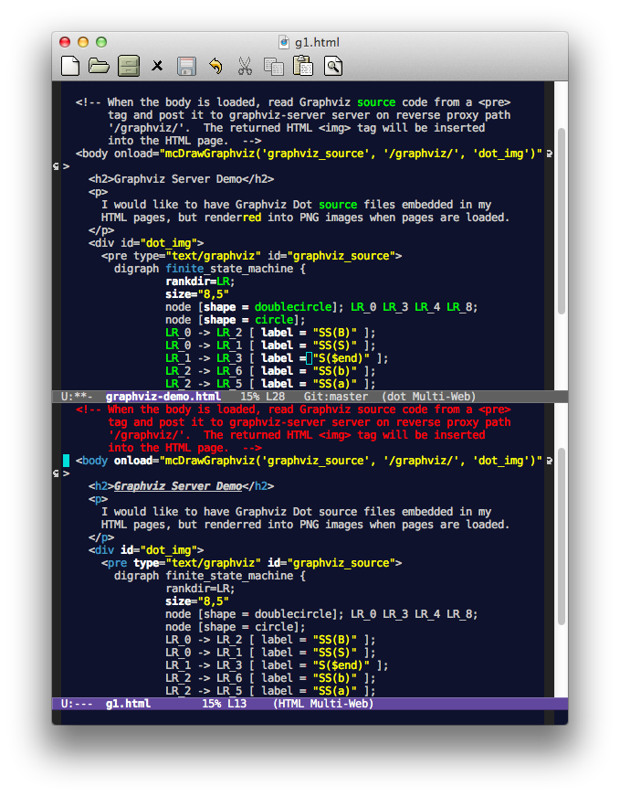

# Embedding Graphviz Graphics in HTML Pages #

Recently, the team I am working with is focused on documenting a
complex online advertising system we developed.  As you know, in
design docs, we would have figures like system architect, data flow
and etc.  As programmers, we don’t want to draw if we can code.  So
it would be great to have Graphviz dot graphics embedding in our
documents in HTML format.

This article describes a solution composed of Emacs-based editing
environment, an Ajax client and a Racket server that invokes Graphviz
for graphics rendering.  The source code is on
[Github](https://github.com/wangkuiyi/graphviz-server).

## Editing ##

We document in HTML format, so we want to embed the Graphviz source
code in a `<pre>` tag.  However, most HTML editors does syntax-highlight
according to HTML format, thus cannot highlight the embedded Graphviz
source code. I found an easy solution is to use Emacs (sorry for
others do not use Emacs), as it is highly customizable.

The solution is to use multi-web-mode.el, a minor mode that selects
the appropriate major mode automatically according to where your point
is.  For example, the following configuration says that if your
pointer is in a section beginning with the regular expression
`"<pre +type=\"text/graphviz\"[^>]*>"` and `"</pre>"`, the
graphviz-dot-mode will be used.

    ;; Multi Web mode
    (load-file "~/.emacs.d/graphviz-dot-mode.el")
    (add-to-list 'load-path "~/.emacs.d/")
    (require 'multi-web-mode)
    (setq mweb-default-major-mode 'html-mode)
    (setq mweb-tags '((php-mode "<\\?php\\|<\\? \\|<\\?=" "\\?>")
                      (js-mode "")
                      (css-mode "")
                      (graphviz-dot-mode "<pre +type=\"text/graphviz\"[^>]*>" "</pre>")))
    (setq mweb-filename-extensions '("php" "htm" "html" "ctp" "phtml" "php4" "php5"))
    (multi-web-global-mode 1)

You can copy-and-paste above configuration into your ~/.emacs file. It
assumes that you have downloaded
[graphviz-dot-mode.el](http://www.graphviz.org/Misc/graphviz-dot-mode.el)
and [multi-web-mode.el](https://github.com/fgallina/multi-web-mode),
put put them into your ~/.emacs.d directory.

The following two screenshots show the difference when you put your
point on the Graphviz source code and on the HTML source code:

 

## Rendering ##

Given an HTML page with Graphviz source code embedded in a `<pre>`
tag, I wrote an Ajax program to send the source code to a server
(graphviz-server).  The server returns an `` tag pointing to the
result image file, the Ajax program then insert this tag in
author-specified place in the HTML page.

The following demo HTML code snippet shows how we specify where to
place the `` tag, and how to invoke graphviz-server:

    </head>
      
    </head>
    <body onload="mcDrawGraphviz('graphviz_source', '/graphviz/', 'dot_img')">
      

        <pre type="text/graphviz" id="graphviz_source">
        	digraph finite_state_machine {
		    ... (more graphviz source code) ...

The `<head>` tag includes the Ajax program graphviz-client.js, which,
as written in the `<body>` tag, will be invoked when the page is
loaded. The mcDrawGraphviz function grabs source code from the inner
text of tag with element id `"graphviz_source"`, which is the `<pre>`
tag blow, and makes a POST HTTP request to the server listen on
`"/graphviz"`, the puts the returned `` tag inside the `
`
tag with element id `"dot_img"`.  

## Serving ##

To respond to the Ajax client, we need a server program, which invokes
the Graphviz suite and renders the POSTed Graphviz source code.  I
guess there have been such servers written in Python, Ruby and other
rapid-programming languages.  Still, I wrote one using the Racket
language (a dialect of Scheme) as a practice.

Racket has a Web-server programming framework, which makes me think
about Rails for Ruby.  But I do not use it.  My code is a tweak of
this
[example program](http://docs.racket-lang.org/more/index.html). It is
a multi-threading server, and each worker thread creates a sub-process
to invoke Graphviz for rendering, if it cannot found a previously
rendered image.

It is notable that the Ajax client cannot access graphviz-server via
its IP and port; instead, due to the security policy of Web browsing,
the Ajax client Javascript program, which was downloaded from the
document server together with the HTML page, can access only URIs
pointing to the same server (the document server), but not the
graphviz-server.

More accurately, when the Javascript program makes an XMLHTTPRequest
object sending HTTP request to a server other than where the
Javascript program was downloaded, the XMLHTTPRequest object will send
an OPTIONS request before the real request.  If server does not
respond security policy matching the OPTIONS request, the
XMLHTTPRequest object won’t send the real request.  This is complex,
so we want to avoid it.

A solution is to setup the document server using Nginx, and make
graphviz-server an upstream server of Nginx.  When the Ajax client
accesses a certain URL of Nginx, Nginx proxies the request to
graphviz-server.  From the perspective of Ajax clients, there is only
one server -- the Nginx server.  The following Nginx server
configuration file shows how to do this:

    server {
      listen       80;
      server_name  graphviz.server;
      root /Users/wyi/Projects/graphviz-server;

      autoindex on;

      location / {
        index index.html index.php;
        try_files $uri $uri/ @backend;
      }

      location /graphviz/ {
        proxy_pass http://graphviz.server:9981;
      }
	}

This defines an Nginx virtual server with name graphviz.server, which
listens on port 80.  When you access `http://graphviz.server/`, the
server returns content of local directory
`/Users/wyi/Projects/graphviz-server`. (You might want a better name
such as `~/blog`.) If you access `http://graphviz.server/graphviz/`,
your request will be proxied to graphviz-server running on the same
computer and listening on port 9981.

Indeed, when you access graphviz-server from a Web browser, a GET
request would be sent, and the server returns an HTML page with usage
information.  The Ajax client program sends POST requests, in which
case, the server would do rendering work and return an `` tag.

To make above configuration work, you need to put it into a file, say,
`document_server.nginx.conf`, and add an include directive to your
Nginx configuration file: 

    include “the/path/to/document_server.nginx.conf”;

Also, you need to modify your DNS settings to assign graphviz.server
an IP address.  For development and testing, just add the following
line into your /etc/hosts file:

    127.0.0.1    graphviz.server

## Setting Up ##

The following steps help you build graphviz-server:

1. Download and install [Racket](http://racket-lang.org) on your
   development computer, which could be the same computer as your
   document server.  You need it to compile graphviz-server into
   native binary.

2. Check out graphviz-server
   [source code](https://github.com/wangkuiyi/graphviz-server) to your
   development computer: 
   
    `git clone https://github.com/wangkuiyi/graphviz-server.git`
  
3. Build graphviz-server: 

    `raco exe graphviz-server.rkt && raco distribute build graphviz-server`
   
   The binary (graphviz-server) and related libraries will be placed
   in subdirectory build. You should copy build to somewhere on your
   document server.

The following steps help you set up your document server:

1. On the document server, create a document directory.  Mine is
   `/Users/wyi/Projects/graphviz-server`.  You might want a better
   name such as `~/blog`.

2. Move `graphviz-client.js` and `graphviz-demo.html` your checked out
   from above Github repository into `~/blog/`.  You won’t edit
   `graphviz-client.js`, but you might want to write your pages
   similar to `graphviz-demo.html`.

3. On the document server, install Nginx. On Debian-like Linux
   distributions, you can use `sudo apt-get install nginx` On Mac OS
   X, you can use [Homebrew](http://mxcl.github.com/homebrew/) `brew
   install nginx`

4. Move `nginx.conf` you checked out into `~/blog/blog.nginx.conf`,
   and add a line to your Nginx configuration file to include
   `~/blog/blog.nginx.conf`.  You might want to change the
   `server_name` directive in `blog.nginx.conf` to use the domain name
   of your document server, or you might want to edit your hosts file
   to assign your localhost a better name as you use it as the
   document server.

5. Start Nginx using `sudo nginx –s start`, or restart it using `sudo
   nginx –s restart`.

6. Start the graphviz-server
   
   `/path/to/build/bin/graphviz-server –d ~/blog –u /blog -p 9981` 
   
   The `-d` parameters specifies a local directory holding the
   generated PNG images. The `-u` parameter specifies a URL prefix
   when returning the PNG image URL.  For example, a generated PNG
   image `~/blog/xxyyzz.png` will be returned as
   `http://graphviz.server/blog/xxyyzz.png`.  The paramters `-p`
   specifies the port on which the server listens.  Please make sure
   the port is the same as specified in `~/blog/blog.nginx.conf`.

## Testing ##

Now, it is time to check your setup. Open a browser, and try entering
the following URLs:

1.	`http://graphviz.server/`
    You should see your documents in `~/blog/`.
	
2.	`http://graphviz.server/graphviz/`
    You should see the hello page of graphviz-server.
	
3.	`http://graphviz.server/graphviz-demo.html`
    You should see an HTML page with a Graphviz-generated PNG image embedded.

